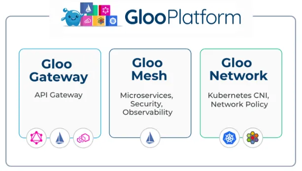
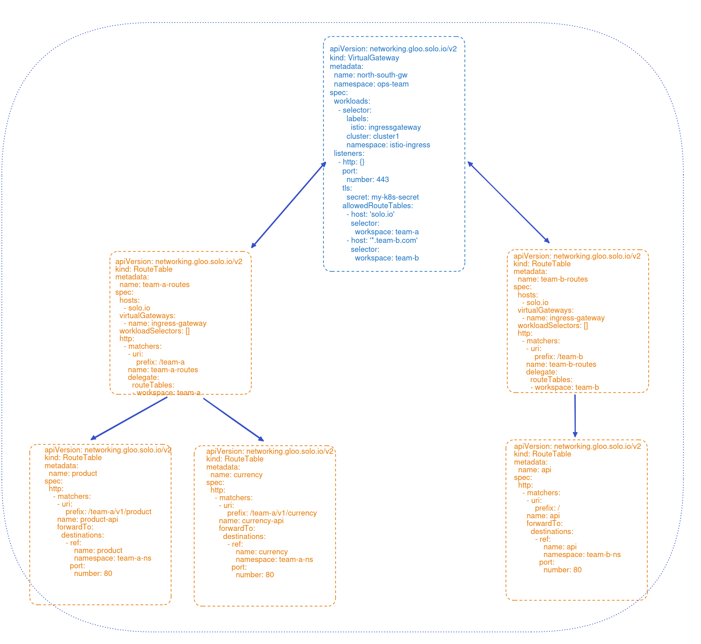

# An Istio / Gloo Platform Multi-Tenancy Example



Gloo Platform integrates API gateway, API management, Kubernetes Ingress, Istio service mesh and cloud-native networking into a unified application networking platform.

This example illustrates Gloo Platform's support for multi-tenancy and how it can lead to better results when managing the configuration of multiple project teams, as compared with open-source Istio.

## Clone GitHub repo

To get started with this example, clone this repo.

```sh
git clone https://github.com/solo-io/gloo-gateway-use-cases.git
cd gloo-gateway-use-cases
```
## Install Istio / Gloo Platform

If you don’t have Gloo Platform installed, there is a simplified installation script available in the GitHub repo you cloned in the previous section. Before you walk through that script, you’ll need three pieces of information.

* Place a Gloo license key in the environment variable GLOO_GATEWAY_LICENSE_KEY. If you don’t already have one of these, you can obtain it from your Solo account executive.

* Supply a reference to the repo where the hardened Solo images for Istio live. This value belongs in the environment variable ISTIO_REPO. You can obtain the proper value from [this location](https://support.solo.io/hc/en-us/articles/4414409064596) once you’re a Gloo Mesh customer or have activated a free trial.

* Supply a version string for Gloo Mesh Gateway in the environment variable GLOO_MESH_VERSION. For the tests we are running here, we use v2.3.4.

If you’ve never installed any Gloo Platform technology before, you will need to import a Gloo Platform helm chart before the installation script below will work properly.

```sh
helm repo add gloo-platform https://storage.googleapis.com/gloo-platform/helm-charts
helm repo update
```

Now from the gloo-gateway-use-cases directory at the top level of the cloned repo, execute the setup script below. It will configure a local k3d cluster containing Gloo Platform and an underlying Istio deployment. The script will fail if any of the three environment variables above is not present.

```sh
./setup/setup.sh
```

The output from the setup script should indicate that you have a healthy cluster with a healthy instance of Istio with Gloo Platform. If you require a more complex installation, a more complete Gloo Platform installation guide is available [here](https://docs.solo.io/gloo-mesh-enterprise/latest/getting_started/). 

Note that while we've set up Gloo Platform to support this entire exercise, Istio is installed as part of that. So for the initial example, we will be using Istio only.

## Istio Example

The purpose of this simple example is to demonstrate a small sample of the issues that can arise when scaling Istio to a larger, multi-tenant environment. In particular, we'll show the following:
* Unreachable routes for some services; 
* Non-deterministic behavior for certain scenarios; and
* Unexpected routing when virtual service changes occur.

For both the Istio and Gloo Platform examples, we will simulate an environment where three teams need to cooperate in order to support a suite of application services.
* An operations team responsible for the platform itself (ops-team); and
* Two application teams (app-1 and app-2) responsible for their own sets of services.

### Spin Up the Base Services

We'll establish a Kubernetes namespace `ops-team` to hold configuration owned by Operations. Then we will establish separate namespaces with a service instance for each of the application teams, `app-1` and `app-2`. The services for each team are based on the [Fake Service](https://github.com/nicholasjackson/fake-service) to keep this example as simple as possible. 

```sh
# Establish ops-team namespace
kubectl apply -f ./multitenant/common/01-ns-ops.yaml
# Deploy app-1 and app-2 to separate namespaces
kubectl apply -f ./multitenant/common/02-app-1.yaml
kubectl apply -f ./multitenant/common/03-app-2.yaml
```

### Establish an Istio Gateway

Configure an Istio `Gateway` listening on port 80 for the host `api.example.com`.

```sh
kubectl apply -f ./multitenant/istio/01-app-gw.yaml
```

### Establish Istio Virtual Services

We'll configure two separate `VirtualService`s on our Gateway. Each VS will have two routes, one that matches on a specifix URL prefix and another catch-all route for all other requests. Establishing default routes on VSes is considered an Istio [best practice](https://istio.io/latest/docs/ops/best-practices/traffic-management/#set-default-routes-for-services).

```yaml
apiVersion: networking.istio.io/v1beta1
kind: VirtualService
metadata:
  name: app-vs-1
  namespace: ops-team
spec:
  hosts:
  - "api.example.com"
  gateways:
  - ops-team/app-gateway
  http:
  - name: "app-1-foo-route"
    match:
    - uri:
        prefix: "/foo"
    route:
    - destination:
        host: app-1.app-1.svc.cluster.local
        port:
          number: 8080
  - name: "app-1-catchall-route"
    route:
    - destination:
        host: app-1.app-1.svc.cluster.local
        port:
          number: 8080
```

Let's establish the `VirtualService` for just `app-1` now:

```sh
kubectl apply -f ./multitenant/istio/02-app1-vs.yaml
```

### Test the App1 Service

With a single tenant, there is no unexpected behavior. Whether we exercise the `/foo` route or the default route, our VS behaves as expected.

```sh
curl -H "host: api.example.com" localhost:8080/foo -i
```

Note that the `/foo` route goes to `app-1` as expected:

```
HTTP/1.1 200 OK
vary: Origin
date: Tue, 20 Jun 2023 18:45:09 GMT
content-length: 260
content-type: text/plain; charset=utf-8
x-envoy-upstream-service-time: 6
server: istio-envoy

{
  "name": "app-1",
  "uri": "/foo",
  "type": "HTTP",
  "ip_addresses": [
    "10.42.0.35"
  ],
  "start_time": "2023-06-20T18:45:09.234491",
  "end_time": "2023-06-20T18:45:09.236515",
  "duration": "2.0242ms",
  "body": "Hello From App-1",
  "code": 200
}
```

Requests that don't match `/foo` are also picked up by `app-1` as expected. For example:

```sh
curl -H "host: api.example.com" localhost:8080/hit/default/route
```

```json
{
  "name": "app-1",
  "uri": "/hit/default/route",
  "type": "HTTP",
  "ip_addresses": [
    "10.42.0.35"
  ],
  "start_time": "2023-06-20T18:48:45.221567",
  "end_time": "2023-06-20T18:48:45.221679",
  "duration": "112.1µs",
  "body": "Hello From App-1",
  "code": 200
}
```

### Configure and Test a Second VirtualService

Note that this scenario takes a turn toward the unexpected as soon as we simulate a second project team introducing a second VS listening on the same `api.example.com` host. In this case, we establish valid routes that capture requests for `/bar` and also a default route. Istio accepts this configuration without errors, but the ambiguity for the default routes creates a problem.

Let's establish the second VS:

```sh
kubectl apply -f ./multitenant/istio/03-app2-vs.yaml
```

But while the `/bar` route behaves as expected and sends traffic to `app-2`...

```sh
curl -H "host: api.example.com" localhost:8080/bar
```

```json
{
  "name": "app-2",
  "uri": "/bar",
  "type": "HTTP",
  "ip_addresses": [
    "10.42.0.36"
  ],
  "start_time": "2023-06-20T18:56:50.043017",
  "end_time": "2023-06-20T18:56:50.043289",
  "duration": "314.6µs",
  "body": "Hello From App-2",
  "code": 200
}
```

...It's as if the default route on `app-2` doesn't exist. Those requests that `team2` expect to be routed to their app go to `app-1` instead. And there's no indication of an error in the `Gateway` or `VirtualService` resources.

```sh
curl -H "host: api.example.com" localhost:8080/goto/app2
```

What?!? `Team2` sees its expected requests route to `app-1` instead:

```json
{
  "name": "app-1-default",
  "uri": "/goto/app2",
  "type": "HTTP",
  "ip_addresses": [
    "10.42.0.35"
  ],
  "start_time": "2023-06-20T19:14:49.185166",
  "end_time": "2023-06-20T19:14:49.185291",
  "duration": "125µs",
  "body": "Hello From App-1 Default",
  "code": 200
}
```

### What's REALLY Happening Here?

Why is Istio ignoring the default route for our `team2`? This is actually a [documented Istio limitation](https://istio.io/latest/docs/ops/best-practices/traffic-management/#split-virtual-services). In cases like this where multiple tenants define similar routes across `VirtualService` resources, Istio chooses its route based on which one has been in existence the longest.

We can see this by deleting the `app-1` VS and then re-applying it. 

Taking this step-by-step:
* Delete `app-1` VS and note that the default route now sends traffic to `app-2`.

```sh
kubectl delete -f ./multitenant/istio/02-app1-vs.yaml
```

```sh
curl -H "host: api.example.com" localhost:8080/goto/app2
```

```
{
  "name": "app-2-default",
  "uri": "/goto/app2",
...snip...
```

* Now add back the `app-1` VS and note that the default route does not restart sending traffic to `app-1`; it insteads goes to `app-2` (because that is now the "older" route).

```sh
kubectl apply -f ./multitenant/istio/02-app1-vs.yaml
```

```sh
curl -H "host: api.example.com" localhost:8080/goto/app1
```

```
{
  "name": "app-2-default",
  "uri": "/goto/app1",
...snip...
```

So we conclude that there are a couple of potential issues.
* Routes can be "lost" when there are `VirtualService` conflicts between resources, even with as few as two tenants.

* Race conditions between `VirtualService` resources, say in parallel branches of CI/CD pipelines, can result in the same logical configurations exhibiting different routing behaviors, non-deterministically, and without any indication of a problem.

While there are certainly techniques to manage these scenarios in open-source Istio, we would like to avoid them altogether with tenant-friendly techniques like routing delegation. Let's see how we might approach this with a value-added layer like Gloo Platform.

## Manage Multiple Tenants with Gloo Platform

We will use the same example services to build our Gloo Platform example. But we will use a technique called [delegation](https://docs.solo.io/gloo-gateway/latest/routing/rt-delegation/) to help us manage the complexity of multi-tenancy. You can read more about Solo's support for multi-tenancy [here](https://docs.solo.io/gloo-gateway/latest/concepts/multi-tenancy/).

First, we'll remove the Istio configurations from the previous exercise.

```sh
kubectl delete -f ./multitenant/istio
```

Second, we'll use a Gloo Platform CRD called `Workspace` to lay down Kubernetes boundaries for multiple teams within the organization. These `Workspace` boundaries can span both Kubernetes clusters and namespaces. In our case we'll define three `Workspaces`, one for the `ops-team` that owns the overall service mesh platform, and two for the application teams, `teama` and `team2`, to whom we want to delegate routing responsibilities.

```sh
kubectl apply -f ./multitenant/gloo/01-ws-opsteam.yaml
kubectl apply -f ./multitenant/gloo/02-ws-appteams.yaml
```

Third, we'll lay down a `VirtualGateway` that selects the Istio Ingress Gateway on our cluster and delegates traffic to `RouteTables` (another Gloo Platform abstraction) that are owned by the `ops-team`.

```sh
kubectl apply -f ./multitenant/gloo/03-vg-httpbin.yaml
```

This diagram below depicts how the `VirtualGateway` and `RouteTable` resources manage traffic in Gloo Platform.



Fourth, we'll establish `RouteTables`. This is the heart of Gloo's multi-tenant support. The first set of RTs are owned by the `ops-team` select the gateway established in the previous step. These RTs intercept requests with a prefix designated for their respective teams, `/team1` and `/team2`, and then delegate to other RTs that are owned by those teams.

```sh
kubectl apply -f ./multitenant/gloo/04-rt-ops-delegating.yaml
```

Fifth, we configure `RouteTables` that are owned entirely by the application teams. They establish routes that are functionally identical to what we built in the Istio-only example, including with default routes for each team's app. These led to the multi-tenancy issues we observed in the original example. But now, because they are deployed in delegated RTs, the default `/` routes no longer introduce any ambiguity or risk of race conditions in determining which route is appropriate.

```sh
kubectl apply -f ./multitenant/gloo/05-rt-team1.yaml,./multitenant/gloo/06-rt-team2.yaml
```

### Test the Gloo Services

Now Gloo route delegation allows application teams to operate independently with their routing decisions. Requests for either `team1` or `team2` are routed exactly as expected.

```sh
curl -H "host: api.example.com" localhost:8080/team1/anything
```

```json
{
  "name": "app-1-default",
  "uri": "/team1/anything",
  "type": "HTTP",
  "ip_addresses": [
    "10.42.0.43"
  ],
  "start_time": "2023-06-21T17:07:08.888625",
  "end_time": "2023-06-21T17:07:08.888746",
  "duration": "121.3µs",
  "body": "Hello From App-1 Default",
  "code": 200
}
```

```sh
curl -H "host: api.example.com" localhost:8080/team2/anything
```

```json
{
  "name": "app-2-default",
  "uri": "/team2/anything",
  "type": "HTTP",
  "ip_addresses": [
    "10.42.0.46"
  ],
  "start_time": "2023-06-21T17:11:29.713765",
  "end_time": "2023-06-21T17:11:29.713990",
  "duration": "225.9µs",
  "body": "Hello From App-2 Default",
  "code": 200
}
```

## Exercise Cleanup

If you used the setup.sh script described earlier to establish your Gloo Platform environment for this exercise, then there is an easy way to tear down this environment as well. Just run this command:

```sh
./setup/teardown.sh
```

## Want to learn more about Gloo Platform?

Read more about Gloo Platform on the [Solo website](https://www.solo.io/products/gloo-platform/) and in the [product documentation](https://docs.solo.io/).
